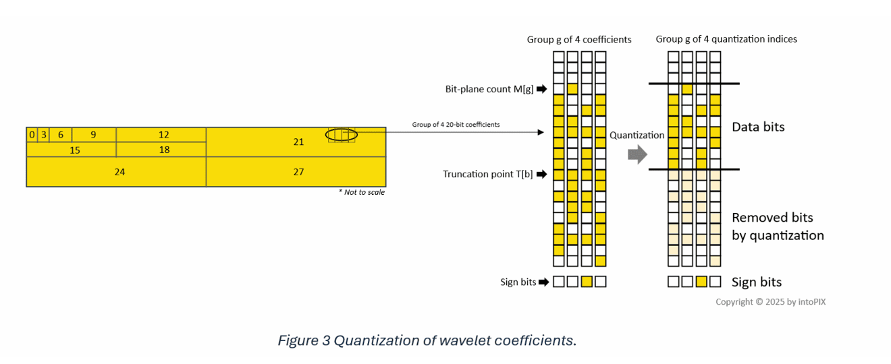
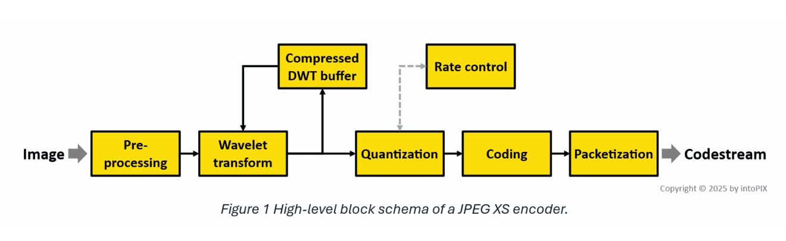
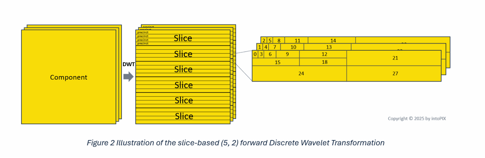

# JXS codec entropy coding

## License
The JXS\_codec\_pipeline is a derivative work and includes in their entirety the files from the ISO-IEC 21122 (5)
software package individually specified in the projects of this solution.

## Overview

You should use this snippet with the xs_ref_sw_ed2 reference software library 
(https://standards.iso.org/iso-iec/21122/-5/ed-2/en/ISO_IEC_21122-5_2_Ed-2.zip).

Add the files JXS\_mls.cpp, image\_create.h (creates the test image) and image\_write.h 
(writes the test images in png format) to the folder libjxs/src of your local copy of the 
xs_ref_sw_ed2 project. Replace CMakeLists.txt in the libjxs folder or add the lines that go 
below the line 
> "# add to your copy (sort of fork) of JPEG XS Reference Software 'xs_ref_sw_ed2'" 

to your existing libjxs/CMakeLists.txt file.

The executable JXS\_mls creates an 24-bit full color test image and encodes it to the JPEG XS 
file without any quantization of wawvelet coefficients (as is the case when using MLS.12 profile). 
The procedure is illustrated with Figure 3, the visual borrowed from 
https://www.jpegxs.com/how-jpeg-xs-works-%E2%80%93-a-simple-introduction 
.

The profile MLS.12 works as if you set a truncation point T[b] below the least significant bit
of quantization indices. In effect, you stop removing bits by quantization when using this profile.

This exercise introduces a procedure that follows the procedures of wavelet decomposition 
(LeGall wavelet, lifting scheme)  and of breaking the 
decomposition data into **precincts** . Wavelet decomposition 
and precinct generation are examined in the other projects of this repo.

The entropy encoding of JPEG XS is perfectly described in the 2017 SMPTE article 
[JPEG-XS - A high quality mezzanine image codec for video over IP](https://dial.uclouvain.be/pr/boreal/object/boreal%3A243235/datastream/PDF_01/view) 
by Richter/Keinert/Foessel/Descampe/Rouvroy/Lorent:

> Following the low-complexity design goals of JPEG XS, entropy coding is extremely simple: 
> First, wavelet coefficients are combined into groups of 4 horizontally-adjacent coefficients each, so called “coding groups”. For each coding group, the topmost populated bitplane of all four 
coefficients combined is computed. This bitplane count is called “MSB position” in the standard, and it is the only quantity that undergoes variable length coding: 
>
>• In the first step, significance groups of 8 coding groups, i.e. 32 coefficients, are formed, and a single bit-flag for each significance group is transmitted, indicating whether any of the 
coding groups in the group carries data at all. If the significance flag is set, the entire significance group is skipped and all 32 coefficients within the group are assumed to be zero 
by the decoder. 
>
> • In the second step, the MSB positions of all remaining significant coding groups are transmitted. JPEG XS provides multiple coding tools for MSB position coding: Either, MSB positions are transmitted in raw, 4 bits per coding group. Or MSB positions are predicted from their left or top neighbor, and the prediction residual is transmitted in a unary code. Optionally, a run-length code may skip over runs of empty coding groups. 
>
> • Third, for all significant coding groups, the absolute value of the quantized wavelet coefficient is transmitted. This includes all bits from the MSB position down to the bitplane the quantizer selected. 
>
> • Fourth, for all non-zero coefficients, the sign bits are transmitted directly. 
>
> The following sections shed additional light on the energy compaction and rate allocation, and how JPEG XS requirements influenced the selection of the transformation and the rate allocation strategy.
>
> Rate control is the second critical component of JPEG XS. Naturally, the more image data is available for rate-allocation purposes, the more precise it can operate, and the better the image 
quality may become.  
>
> • Some strategies proposed were based on heuristics, using the statistics of the previous frame to allocate the rate for the current frame. For example, the JPEG 2000 based proposal could not use a full EBCOT tier 2 rate allocation due to the latency constraint imposed by the JPEG XS requirements. Any heuistic, however, has the drawback that quality degradations may appear on scene cuts, i.e. under dramatic changes of the coefficient statistics. While such degradations are masked away by the scene cut and are thus typically not visible for human observers, they may be still undesirable in applications where material is post-processed after transmission. They would introduce an additional error source that should be avoided.  
>
> • Other proposals used a line-by-line rate-allocation and make excess rate not spend in the current line available to the next if bandwidth and latency permits. For DCT based proposals, rate allocation included in one proposal a detection of blocking defects and assigns more rate to blocks that would be succeptible to such defects. 
>
> • Another approach is to run rate-allocation on a somewhat larger lookahead window, thus having the advantage of already allocating rate on the current line for critical content in the future of the encoder. Clearly, the size of the window cannot exceed the maximum tolerable latency as the encoder has to delay its coding process until the full lookahead window becomes available. 
>
> • Finally, some proposals used a rate-control-loop approach that observes rate spend so far, adapting quantization as necessary. The control-loop approach was refined in one proposal by a model of human vision such that quantization defects remain below the just-noticable difference.  
>
> Overall, experiments have shown that the approach based on a lookahead window works best, though experiments on alternative wavelet filters such as the 13/7 filter are still ongoing. Preliminary results will be presented below. While longer filters provide better quality, they also reduce the amount of lookahead available for the rate-allocator. Finding a good trade-off between the latency taken by rate-allocation and the latency introduced by energy-compaction is the purpose of the ongoing work of the committee. 

In order to simplify the program flow analysis, the exercise may be later re-worked with unfolding 
the xs\_enc\_init(&xs\_config, &image) and xs\_enc\_image(ctx, &image, ...) functions of the libjxs library 
in the manner how this is done in the JXS\_precincts project.